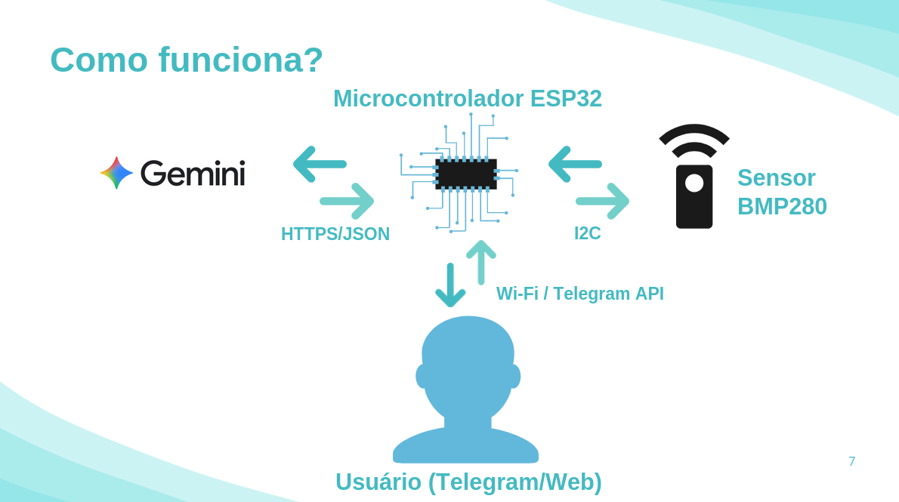

# ☁️ MindCast: Bio-Atmospheric Sync

<div align="center">
  
</div>

> **"Sincronize sua biologia com o ambiente ao seu redor."**

O **MindCast** é um sistema IoT de bio-feedback desenvolvido em C++ para ESP32. Ele monitora variáveis ambientais (Temperatura e Pressão Atmosférica) e utiliza **Inteligência Artificial Generativa (Google Gemini 2.0 Flash)** para fornecer insights de produtividade e bem-estar em tempo real.

Não é apenas uma estação meteorológica; é um **Coach Cognitivo** que traduz dados físicos brutos em ações biológicas para combater a fadiga e aumentar a performance.

---

## ⚙️ Como Funciona



1.  **Coleta:** O microcontrolador **ESP32** lê temperatura e pressão via sensor **BMP280** (Protocolo I2C).
2.  **Processamento:** Os dados são enviados via HTTPS (SSL/TLS) para a **API do Google Gemini 2.0**.
3.  **Inteligência:** O algoritmo "Coach 3.0" analisa o impacto biológico dos dados no perfil do usuário.
4.  **Interface:** O usuário recebe o insight via **Bot do Telegram** ou visualiza no **Dashboard Web**.

---

## 💻 Arquitetura de Software

O firmware foi desenvolvido com foco em eficiência e multitarefa não-bloqueante:

* **Multitarefa Real (Non-blocking):** Utilização de temporizadores baseados em `millis()` em vez de `delay()`. Isso permite que o **Web Server** e o **Telegram Bot** operem simultaneamente sem travamentos.
* **Camada de Conectividade:**
    * **HTTPS Seguro:** Cliente `WiFiClientSecure` para comunicação criptografada com a API do Google.
    * **Telegram Long-Polling:** Otimização para recebimento rápido de comandos.
* **Engenharia de Prompt (Edge):** O ESP32 constrói dinamicamente um prompt complexo (JSON) contendo dados do sensor e perfil do usuário para guiar a IA na geração de respostas curtas e acionáveis.
* **Interface Web Embarcada:** Servidor HTTP rodando na porta 80 servindo uma página HTML/CSS responsiva com design *Glassmorphism*, atualizada automaticamente via Meta-Refresh.

---

## 🚀 Funcionalidades

* **Monitoramento em Tempo Real:** Leitura precisa de temperatura (°C) e pressão (hPa).
* **AI Insights:** Integração nativa com LLM (Gemini) para análise de contexto.
* **Interface Omni-channel:**
    * 📱 **Telegram Bot:** Comandos `/agora` e `/perfil` com teclado interativo.
    * 💻 **Web Dashboard:** Painel visual para monitoramento passivo na rede local.

---

## 🛠️ Hardware Necessário

* Microcontrolador ESP32 (DevKit V1 ou similar)
* Sensor de Pressão e Temperatura BMP280 (Protocolo I2C)
* Cabos Jumpers e Protoboard

---

## 📦 Instalação e Configuração

### 1. Pré-requisitos (Arduino IDE)
Instale as bibliotecas necessárias através do Gerenciador de Bibliotecas:
* `UniversalTelegramBot` (Brian Lough)
* `ArduinoJson` (Benoit Blanchon) - *Versão 6 ou superior*
* `Adafruit BMP280 Library` (Adafruit)
* `Adafruit Unified Sensor` (Adafruit)

### 2. Configuração do Código
Abra o arquivo `MindCast.ino` e preencha suas credenciais nas linhas iniciais:

```cpp
#define WIFI_SSID     "SUA_REDE_WIFI"
#define WIFI_PASSWORD "SUA_SENHA_WIFI"
#define BOT_TOKEN     "SEU_TOKEN_TELEGRAM" // Obtenha com o @BotFather
#define CHAT_ID       "SEU_CHAT_ID"        // Obtenha com o @IDBot
#define GEMINI_API_KEY "SUA_API_KEY_GOOGLE" // Obtenha no Google AI Studio
```
### 3. Upload
Selecione a placa DOIT ESP32 DEVKIT V1, conecte via USB e faça o upload. Nota: Certifique-se de que o sensor BMP280 está conectado aos pinos I2C padrão (SDA: GPIO 21, SCL: GPIO 22).

## 👥 Autores
Projeto desenvolvido na disciplina Microprocessadores e Microcontroladores (LOM3233) do curso de Engenharia Física da EEL-USP.
* Enzo Giovanni Benko
* Victor Gabriel Moreira da Silva
